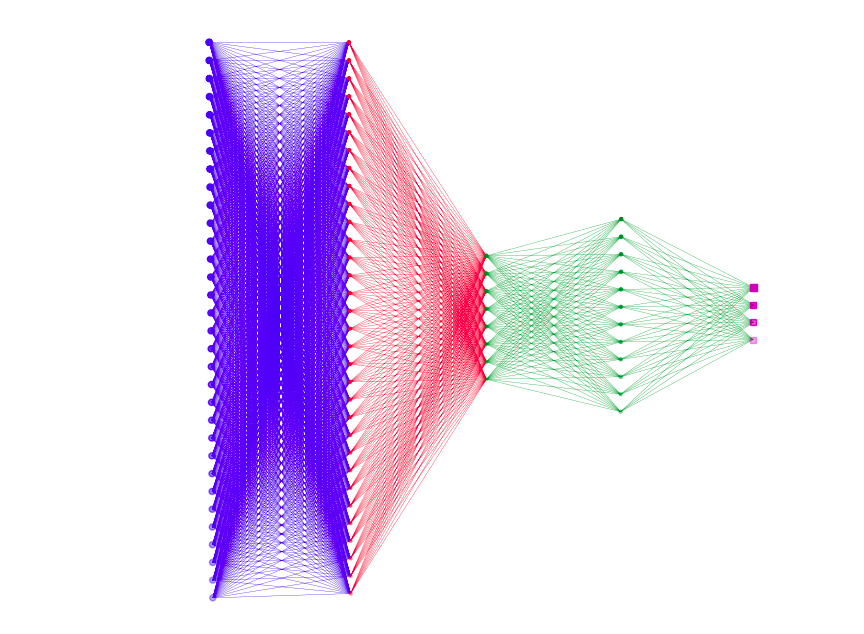
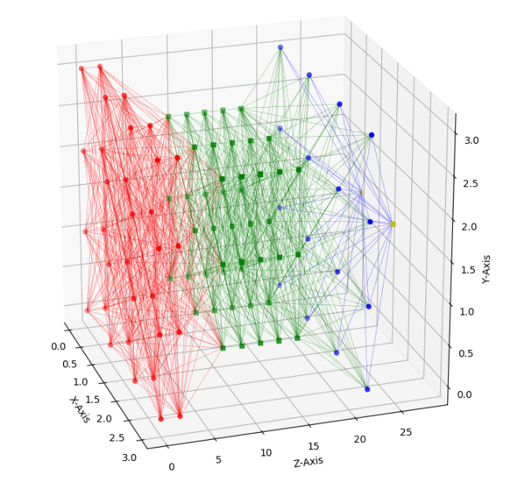
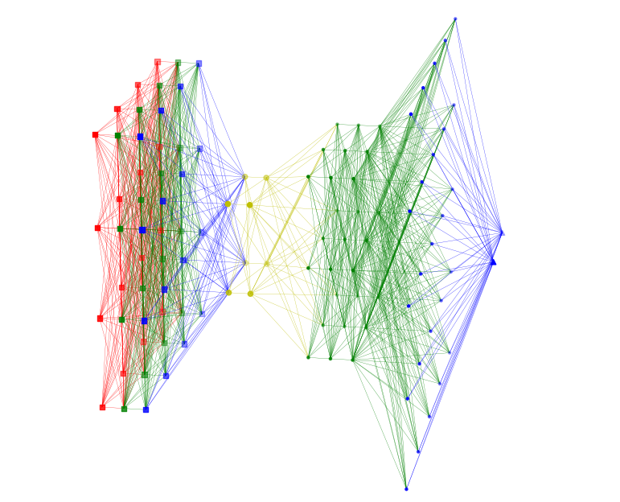
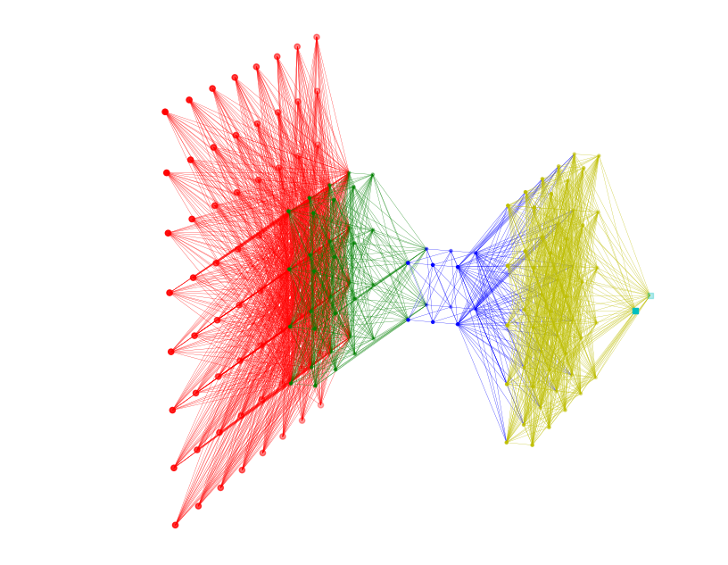
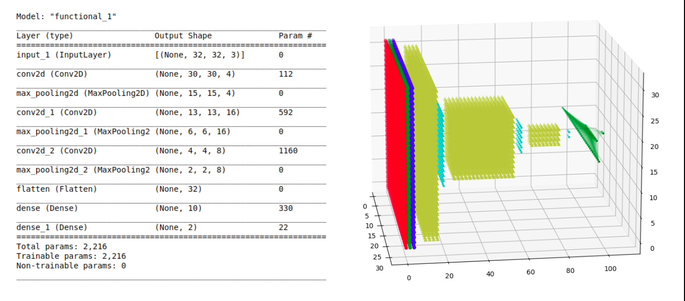
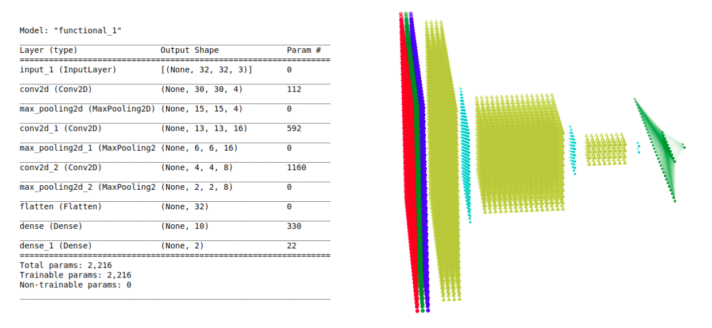

# Neural Plot
## A module for visualizing Neural Networks of the TensorFlow/Keras models.
### This Libary is working on Matplotlib
#### Currently Under Development
<br>

### Single Layer Graph Plotting _(Development Notebooks/1-Neural Net.ipynb)_

```python
for i, c in enumerate(['r', 'g', 'b']):
    x,y,z = mat3dl(32, 32, 3, (i,i+1))
    ax.scatter(x, z, y, c=c, marker='o')
plt.show()
```


## Multilayer Layer Graph Plotting _(Development Notebooks/2-Neural Net.ipynb)_

```python
layers = [(32, 32, 3, 'rgb', '.'),(16, 16, 5, 'r', '+'),(20,20,3,'y', 's'),(5,5,5),(10,1,1,'b', '^')]
neuralplot(layers)
```


## 2D Network Plot _(Development Notebooks/3-Neural Net.ipynb)_
```python
layers = [(1, 32, 1, 'b','o'),(1, 32, 1, 'r', '.'),(1, 8, 1, 'g', '.'),(1, 12, 1, 'g', '.'),(1, 4, 1, 'm', 's')]
neuralplot(layers)
```



## Plot Simple 3D Network  _(Development Notebooks/3-Neural Net.ipynb)_



## Plot Complex 3D Networks _(Development Notebooks/3-Neural Net.ipynb)_
```python
layers = [(4, 4, 3, 'rgb','s'),(2, 2, 2, 'y', 'o'),(3, 3, 3, 'g', '.'),(5, 5, 1, 'b', '.'),(2, 1, 1, 'b', '^')]
neuralplot(layers)
```



```python
layers = [(8, 8, 1, 'r','o'),(4, 4, 2, 'g', '.'),(2, 2, 3, 'b', '.'),(5, 5, 2, 'y', '.'),(2, 1, 1, 'c', 's')]
neuralplot(layers)
```



## TensorFlow/Keras Models to 3D Networks Graph _(Example Notebook.ipynb)_

```python
from neuralplot import neuralplot
neuralplot(model=model, grid=True, connection=True, linewidth=0.1)
```


```python
neuralplot(model=model, grid=False, connection=True, linewidth=0.1)
```

